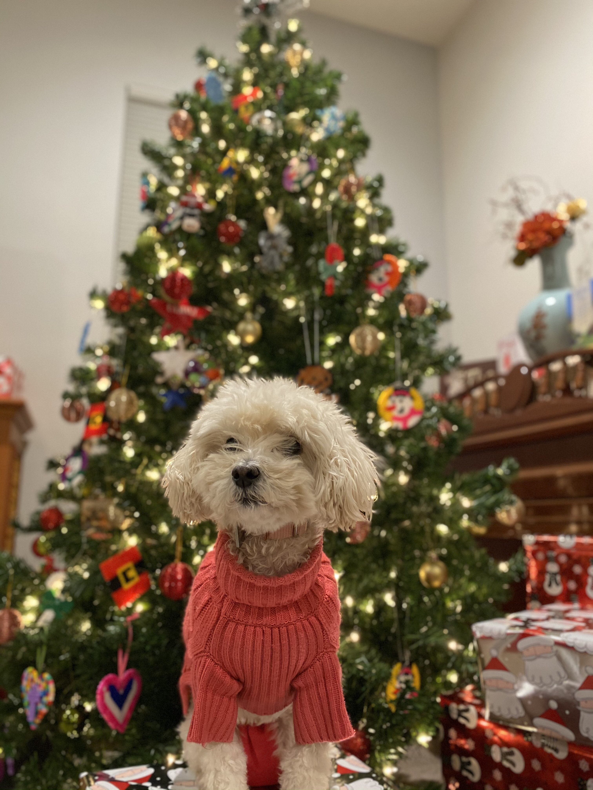

# Welcome to Tamagogani's Github Profile
Hi I'm Tamagogani! I'm an aspiring data-scientist and a avid dog enthusiast.
I primarily code in python and C++ but I also know R, Matlab, and Java.
I'm currently learning html, css, and javascript in hopes of doing some cool
web based data science visualizers.

## Table of Contents
1. [Personal Background](#Personal-Background)
2. [Technical Skills](#Technical-Skills)
3. [Projects](#Projects)
4. [WIP](#WIP)

## Personal Background
### Pets
This is *Miracle*, a female Maltese Poodle. Miracle is a big fan of food and play
time but not a big fan of costumes :joy:. According to my mother:
> "Miracle is the best girl"



[**Here's a video of Miracle being cute**](https://www.youtube.com/watch?v=dQw4w9WgXcQ)
### Miracle's Lists
#### Miracle's Favorite foods
- Treats
- Chicken
- Cabbage
- ~~vitamins~~

#### Miracle's Todo List
- [ ] Catch a  lizard
- [x] play ball
- [x] do tricks for treats


## Technical Skills
Python is probably my best language. Probably my favorite code snippet is the
following.

```python
import numpy as np
import sklearn as sk
import torch.nn as nn
```

I like pytorch more than tensorflow, but I'm warming up to the new (relatively)
keras integration.

## Projects
I can't go into too much detail about the work I've done during internships
but I'll list them along with some of the other things I've done alone

- BOLD Scan Denoising and Analysis
- Implemented NN by hand
- Terrible image captioning using transfer learning
- Even worse (WIP) Image Recognition (recognizing whether a dog is Miracle or
  not Miracle)

Considering I don't have a very large dataset of Miracle, that last model is
going to be a WIP for a while.

## WIP
***Finding something really important to say***
**Finding something slightly less _important_ to say**
